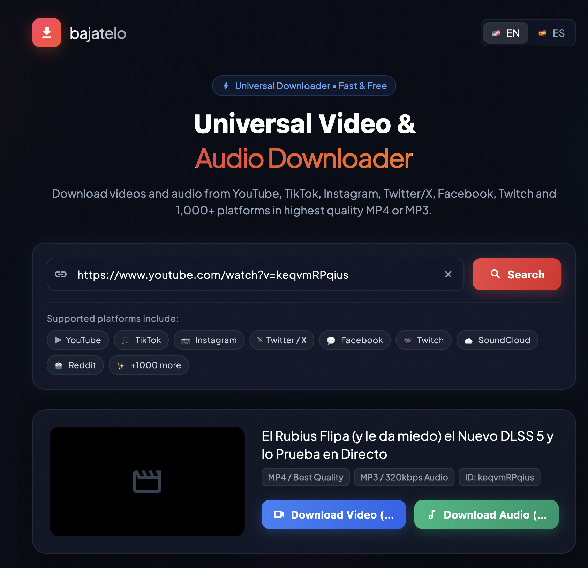

# Bajatelo App 🚀

A 100% standalone, cross-platform Flutter application for downloading videos and audio. This app is the native evolution of the Bajatelo web app, designed to run completely offline on your device without needing a remote backend!



## 🌟 Features
- **Cross-Platform:** Runs natively on Android, macOS, Windows, and Linux.
- **Embedded yt-dlp:** Powered by `yt-dlp` running locally on your hardware.
- **Video & Audio Modes:** Download high-quality video (MP4) or extract audio directly (MP3).
- **Responsive UI:** A beautiful, dark glassmorphic design that adapts from mobile screens to wide desktop windows.
- **Multilingual:** Auto-detects your system language (English & Spanish supported).
- **History Tracking:** Local persistent history of all your downloaded media.

## 🏗️ Architecture

Because `yt-dlp` requires Python, the app employs two distinct native engines depending on the platform:

1. **Desktop Engine (macOS, Windows, Linux):**
   - Keeps the app bundle extremely small by dynamically downloading standalone, pre-compiled `yt-dlp` and `ffmpeg` binaries to the application support directory on the very first launch.
   - Executes these binaries via native Dart subprocesses (`Process.start`) and parses stdout for progress.
   - **macOS Security Note:** The macOS App Sandbox is intentionally disabled in this project. Sandboxing strictly prevents the execution of unbundled binaries downloaded at runtime, which is required for our dynamic `yt-dlp` and `ffmpeg` engine.

2. **Android Engine:**
   - Uses the `youtubedl-android` wrapper which embeds a minimal Python runtime natively.
   - Communicates with Flutter via Kotlin `MethodChannel` and `EventChannel`.
   - Downloads directly to the `Downloads` folder and registers the media using Android's `MediaStore` so it instantly appears in your gallery.
   - *(Requires Minimum SDK 24).*

*(Note: iOS is currently deferred due to App Store restrictions on bundling execution runtimes like Python/yt-dlp.)*

---

## 🛠️ Prerequisites

To build and run this project, you need the following installed:
1. [Flutter SDK](https://docs.flutter.dev/get-started/install) (v3.47.3 or higher)
2. **For Android:** Android Studio, Android SDK, and an emulator/device.
3. **For macOS:** 
   - Xcode (requires macOS 10.15+ deployment target).
   - [CocoaPods](https://cocoapods.org/) (for managing macOS platform dependencies). If not installed, you can install it via Homebrew: `brew install cocoapods`.

---

## 🚀 Getting Started

1. **Clone the repository:**
   ```bash
   git clone https://github.com/rmaynar/bajatelo-app.git
   cd bajatelo-app
   ```

2. **Install Dependencies:**
   ```bash
   flutter pub get
   ```

3. **Run the App:**

   *To see available devices:*
   ```bash
   flutter devices
   ```

   *To run on macOS (Desktop):*
   ```bash
   flutter run -d macos
   ```

   *To run on an Android Emulator or connected device:*
   ```bash
   flutter run -d android
   ```

---

## 📦 Building for Release

### Android
Build a release APK or AAB:
```bash
flutter build apk --release
# OR
flutter build appbundle --release
```
*The built APK will be located at `build/app/outputs/flutter-apk/app-release.apk`.*

### macOS
Build a release macOS app:
```bash
flutter build macos --release
```
*The built application will be located at `build/macos/Build/Products/Release/bajatelo_app.app`.*

---

## 🧑‍💻 Contributing
- **UI/UX Changes:** Modify code within `lib/screens` and `lib/widgets`.
- **State Management:** Riverpod providers are located in `lib/core/providers`.
- **Native Bridges:** 
  - Android Kotlin code is in `android/app/src/main/kotlin/maynar/bajatelo/bajatelo_app/MainActivity.kt`.
  - Desktop Dart subprocess code is in `lib/services/desktop/`.
